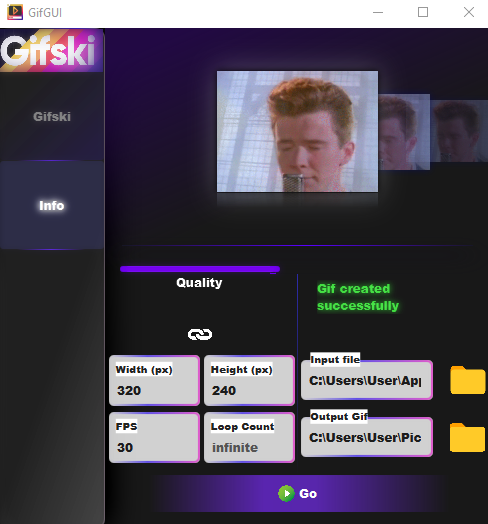
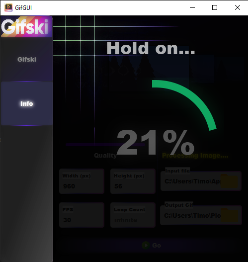

# Gifski Windows GUI

Application to Generate [Gifski](https://github.com/ImageOptim/gifski) CMDs through a visual Interface.
Still in an Experimental phase. Using not recommended at this time.

---
## Images

-----
## Licenses
AGPL 3 or later as Stated on the Gifski repository
